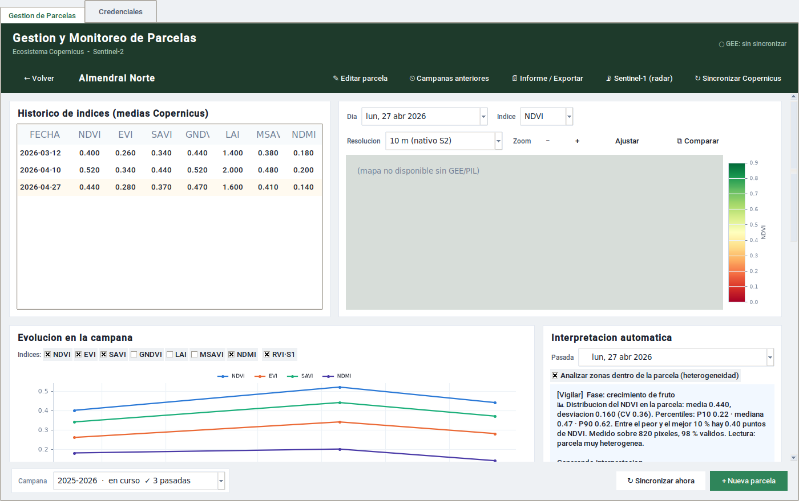
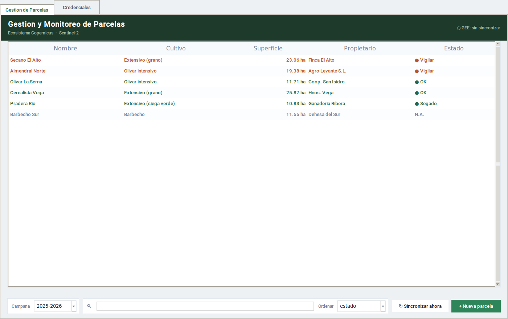
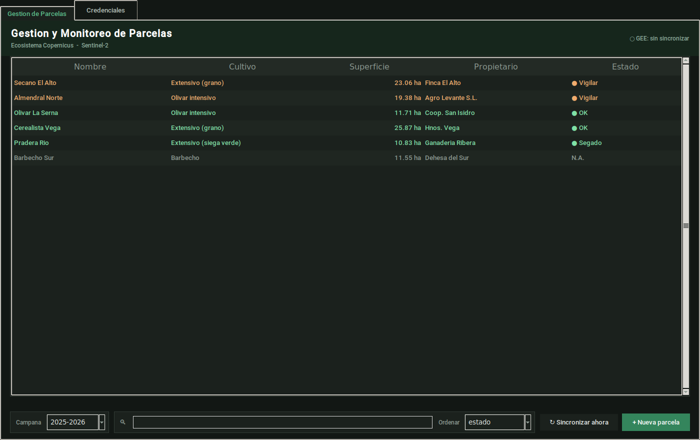

# Gestor de Parcelas · Copernicus

[](https://github.com/gonzalomunozps-spec/Code-/actions/workflows/pruebas.yml)

Aplicación de escritorio para **monitorizar parcelas agrícolas con imágenes de
satélite**. Para cada parcela descarga imágenes **Sentinel-2** (óptico) y
**Sentinel-1** (radar) a través de Google Earth Engine, calcula índices de
vegetación, estima la **fase fenológica** según especie y fecha de siembra, y
emite un diagnóstico —`OK` / `Vigilar` / `Revisar`— coherente con esa fase.



---

## Qué hace, en una frase

Te dice **qué parcelas mirar hoy** y **por qué**, en vez de dejarte una tabla de
números que interpretar a mano.

- **Índices de vegetación** por pasada: NDVI, GNDVI, NDMI, SAVI, EVI, MSAVI, LAI.
- **Diagnóstico por fase**: los umbrales no son fijos por cultivo, sino que
  cambian con la fase fenológica (un olivar en julio no se juzga como en marzo).
- **Leñosos bien tratados**: distingue el vigor de la **copa** del verdor de la
  **calle**, que es el error clásico de mirar el NDVI medio de un olivar.
- **Aprendizaje por validación**: cuando corriges un diagnóstico, el sistema lo
  recuerda y ajusta los siguientes del mismo cultivo y fase.
- **Cuaderno de campo**: eventos (siembra, riego, herbicida, cosecha) que además
  se usan para explicar caídas del NDVI en vez de tratarlas como anomalías.
- **Radar Sentinel-1** bajo demanda, para cuando las nubes tapan el óptico.
- **Contexto climático** de ERA5-Land (temperatura, lluvia, ET0, radiación).

Tema **claro y oscuro**:




---

## Instalación

Necesitas **Python 3.10 o superior**.

**Tkinter no se instala con pip.** Viene con Python en Windows y macOS; en Linux
es un paquete del sistema:

```bash
sudo apt install python3-tk        # Debian / Ubuntu
```

Luego, las dependencias:

```bash
pip install -r requirements.txt
```

O, si prefieres instalarlo como paquete (deja disponible el comando
`gestor-parcelas`):

```bash
pip install .            # solo lo imprescindible
pip install ".[todo]"    # con ChatGPT, informes PDF/Excel y carpeta estándar
```

### Instalación automática (con acceso directo en el escritorio)

Si prefieres no tocar la línea de comandos más de lo justo, hay un instalador que
prepara un entorno con las dependencias y **crea un acceso directo en el escritorio**
(Windows, Linux y macOS):

```bash
python instalar.py              # entorno + dependencias + acceso directo
python instalar.py --sin-venv   # usa tu Python actual (si ya tienes las dependencias)
python desinstalar.py           # lo quita todo (el acceso y el entorno)
```

**Desinstalar NUNCA borra tus datos** (`parcelas.db`): el desinstalador te dice
dónde están para que decidas tú. Instalar es opcional: el programa se puede usar
sin instalar (ver abajo).

---

## Arranque

```bash
python iniciar.py                  # arranca SIN instalar nada
python panel_gestion_parcelas.py   # lo mismo, nombre largo
# o, si lo instalaste como paquete:
gestor-parcelas
```

`gestor-parcelas --version` dice la versión sin abrir la ventana.

### Probar sin satélite ni credenciales

Para verlo funcionando con datos de ejemplo:

```bash
python demo_sistema.py             # siembra 6 parcelas de ejemplo
python panel_gestion_parcelas.py   # y ábrelas
```

### Conectar Earth Engine

El programa abre sin credenciales, pero no podrá descargar imágenes. En la
pestaña **Credenciales** pulsa *Iniciar sesión con Google* (la contraseña se
escribe en la página de Google, nunca aquí). La clave de OpenAI es opcional: sin
ella la interpretación se genera por reglas en vez de con ChatGPT.

Los pasos completos —incluida la autenticación por terminal y las cuentas de
servicio para servidores sin navegador— están en **[COMO_ARRANCAR.md](COMO_ARRANCAR.md)**.

---

## Dónde se guardan los datos

En la carpeta de datos del usuario, **no** en la del programa:

| Sistema | Ruta |
|---|---|
| Windows | `%LOCALAPPDATA%\gestor_parcelas\` |
| macOS   | `~/Library/Application Support/gestor_parcelas/` |
| Linux   | `~/.local/share/gestor_parcelas/` (o `~/.gestor_parcelas`) |

Todo vive en un único `parcelas.db` (SQLite). **Para una copia de seguridad basta
con copiar esa carpeta.** Se puede cambiar con `GESTOR_PARCELAS_DIR`.

---

## Pruebas

```bash
python pruebas.py            # 888 pruebas, sin pantalla ni red
python pruebas_interfaz.py   # monta la aplicación real y la recorre
```

En un servidor sin pantalla: `xvfb-run -a python pruebas_interfaz.py`.

Las dos suites corren **solas en cada push y cada pull request** (GitHub Actions,
`.github/workflows/pruebas.yml`): un cambio que rompa algo no llega a verde sin
avisar. El runner instala solo lo que las pruebas ejercen de verdad —sin
`earthengine-api` ni `tkintermapview`—, con lo que de paso comprueba que el
programa degrada bien sin sus módulos opcionales.

---

## Cómo está hecho

Python + Tkinter, con la lógica en capas y sin ciclos: la lógica agronómica es
pura y probada, la base de datos tiene un único punto de acceso, y lo que habla
con Earth Engine está aislado y es inyectable (por eso se prueba sin red). Varios
módulos son **opcionales**: si borras el fichero, la función desaparece y el resto
sigue igual.

El detalle está en **[ARQUITECTURA.md](ARQUITECTURA.md)**, que documenta el mapa
de módulos y los invariantes que conviene no romper.

> **Regla de oro:** la lógica agronómica (fases, umbrales, contraste de índices)
> es el núcleo de valor y está probada. No se cambia sin una razón agronómica
> explícita.

---

## Licencia

[MIT](LICENSE). Antes de publicarlo, pon tu nombre en el fichero `LICENSE` donde
dice `<TU NOMBRE>`.
